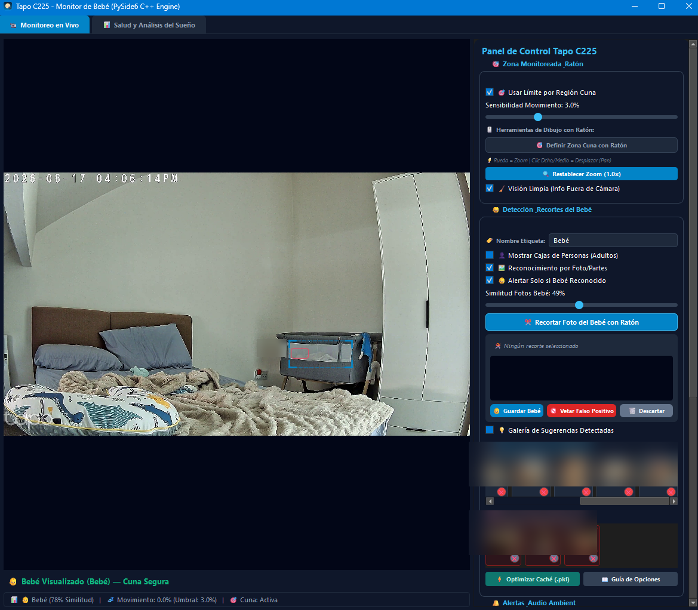
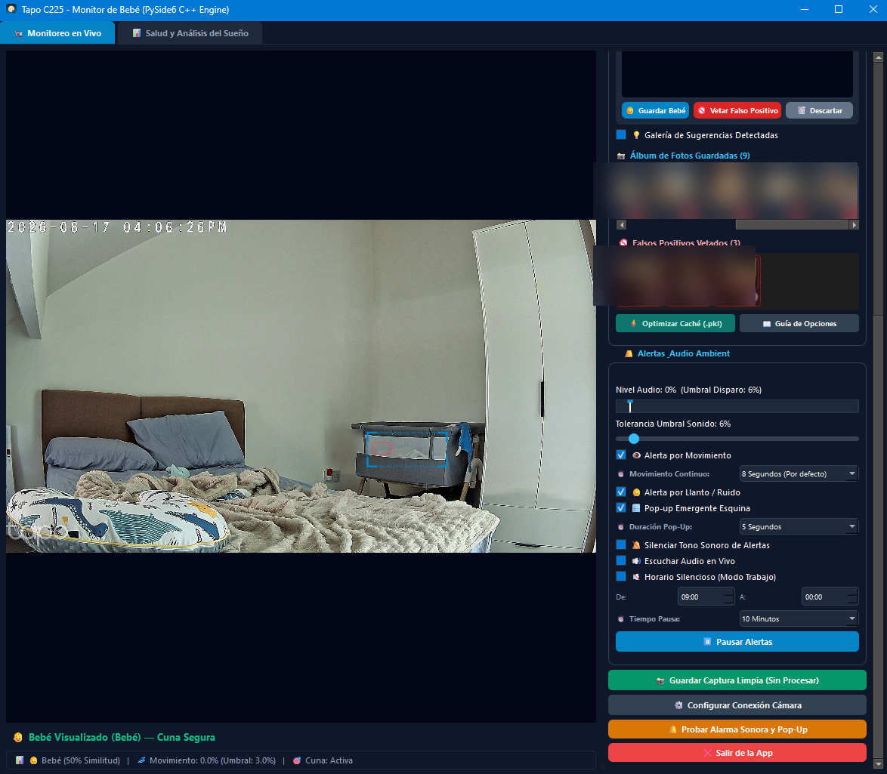
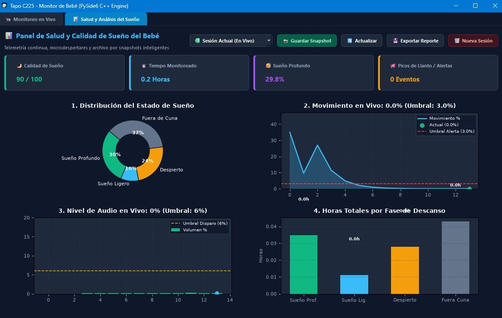

# 👶 Tapo C225 AI Baby Monitor — Smart Edge Vision Assistant

<p align="center">
  <a href="#-english-summary"><b>🇬🇧 English</b></a> • 
  <a href="#-resumen-en-español"><b>🇪🇸 Español</b></a> • 
  <a href="docs/USER_GUIDE.md"><b>📖 User Manual</b></a> • 
  <a href="docs/ARCHITECTURE.md"><b>🧠 Architecture & Algorithms</b></a> • 
  <a href="docs/FAQ.md"><b>❓ FAQ</b></a>
</p>

<p align="center">
  <a href="https://www.python.org/"></a>
  <a href="https://www.qt.io/"></a>
  <a href="https://github.com/ultralytics/ultralytics"></a>
  <a href="https://opencv.org/"></a>
  <a href="https://matplotlib.org/"></a>
  <a href="https://github.com/google"></a>
  <a href="LICENSE"></a>
</p>

> A professional-grade, **100% private (Edge AI)** smart baby monitor assistant for **[TP-Link Tapo C225](https://www.tapo.com/product/smart-camera/tapo-c225/)** cameras (also compatible with Tapo C200, C210, C220, C100, TC70).  
> Features **ultra-low latency (<50ms)**, **neural silhouette segmentation**, **false-positive vetoing**, **pediatric sleep analytics with Matplotlib**, **silent work schedule mode**, and **Always-on-Top floating alerts**.

---

## 📸 Visual Tour & User Interface Overview

<p align="center">
  
</p>

### 🖥️ 1. Live Monitoring & Vision Panel (`Monitoreo en Vivo`)
* **2K Video Stream with Zoom & Pan:** Smooth 30 FPS direct RTSP feed with mouse-wheel zoom and right-click drag navigation.
* **Crib Region of Interest (ROI):** Click *"Definir Zona Cuna con Ratón"* to restrict movement and recognition alerts strictly inside the baby's bed.
* **Clean Vision Overlay (`Visión Limpia`):** Mathematical telemetry (similarity, movement %, crib state) rendered outside the video frame so the camera image remains completely unobstructed.
* **Smart Baby Cropping Tool:** Select facial angles, feet, or body positions and save them into the template gallery (`Álbum de Fotos Guardadas`).
* **Negative False-Positive Veto Gallery (`Falsos Positivos Vetados`):** One-click cropping for pillows, blankets, or adult faces to permanently suppress false alerts via competitive scoring ($\Delta = \text{Score}_{pos} - 0.70 \times \text{Score}_{neg}$).
* **Binary Fast Cache (`Optimizar Caché .pkl`):** Serializes all templates into memory for instant startup and zero inference lag.

<p align="center">
  
</p>

### 🎛️ 2. Audio Ambient, Alerting & Quiet Hours
* **Live Audio VU Meter & Sound Threshold:** Real-time volume gauge with a custom sensitivity slider (e.g. 6%) to catch crying episodes.
* **Continuous Movement Cooldown:** Configurable timer (e.g. 8 seconds) before triggering restlessness alarms.
* **Always-on-Top Floating PiP Alerts:** Non-intrusive corner pop-ups with live snapshots that appear over full-screen games or work apps.
* **Work Quiet Hours (`Horario Silencioso`):** Automatically mutes beeps during scheduled meetings (e.g. 09:00 to 18:00) while keeping visual notifications active.
* **Pause Alerts Button:** Temporarily suppresses alarms for 5 to 60 minutes during feeding or diaper changes.

<p align="center">
  
</p>

### 📊 3. Real-Time Pediatric Sleep Health Dashboard (`Salud y Análisis del Sueño`)
* **Top KPI Metric Cards:** Instant view of Sleep Quality Score (0-100), Monitored Hours, Deep Sleep %, and Crying Alerts.
* **Live Streaming Waveforms:** Sub-second continuous movement and audio graphs with dynamic threshold lines matching user settings in real time.
* **Sleep Stage Donut Chart:** Visual breakdown of Deep Sleep, Light Sleep, Awake, and Out of Crib states.
* **Smart Snapshots & CSV Export:** Generates ultra-lightweight telemetry logs and one-click exportable reports for pediatrician consultations.

---

# 🇬🇧 English Summary

## ⚖️ Value Comparison

| Feature | Official TP-Link Tapo App | 👶 Tapo C225 AI Monitor (This Project) |
| :--- | :--- | :--- |
| **Cost & Subscriptions** | Requires **Tapo Care Cloud ($3 - $10/month)**. | **100% Free and Open Source.** Zero fees forever. |
| **Video Privacy** | Routes through external cloud servers. | **100% Local (Private LAN).** Video never leaves your home network. |
| **Stream Latency** | 1.5 to 3.0 seconds (cloud relay delay). | **< 50 milliseconds (RTSP TCP Direct @ 30 FPS)**. |
| **Parent Discrimination** | Alarms trigger indiscriminately when parents enter. | **Layering System & Adult Filter:** Recognizes baby specifically. |
| **Crib False Positives** | Bedding folds/shadows trigger false alarms. | **Triple Veto & Anti-Jitter:** Spatial + structural rejection of bedding folds. |
| **Desktop / Work Workflow** | No native Windows desktop client. | **Native PySide6 (Qt6) App:** Floating PiP alert window. |
| **Sleep Health Analytics** | Basic non-exportable history. | **Matplotlib Sleep Dashboard:** 4 charts + 1 KB Smart Snapshots. |

---

## 🚀 Quick Start (Windows)

### Option 1: Standalone Binary (Zero Setup) ⭐ *Recommended for Parents*
1. Download `TapoC225_BabyMonitor_Windows.zip` from **[Releases](https://github.com/pabloemmanueldeleo/TapoC225-Baby-Monitor/releases)**.
2. Extract the ZIP and double-click `TapoC225_BabyMonitor.exe`.
3. Follow the **Visual Setup Wizard** to enter your camera's local IP and credentials.

### Option 2: Running from Source (Developers)
```bash
git clone https://github.com/pabloemmanueldeleo/TapoC225-Baby-Monitor.git
cd TapoC225-Baby-Monitor
uv sync              # or: pip install -r requirements.txt
uv run main.py       # or: double-click Iniciar_Monitor_Silencioso.vbs
```

---

## 📚 Detailed Documentation
- 📖 **[User Manual & Camera Setup Guide](docs/USER_GUIDE.md)** — Step-by-step setup, FAQ 2680 guide, UI walkthrough, and tips.
- 🧠 **[Architecture & Algorithmic Design](docs/ARCHITECTURE.md)** — Decoupled 2-layer vector pipeline, Laplacian filters, and telemetry compression.
- ❓ **[FAQ & Troubleshooting](docs/FAQ.md)** — Supported models, offline LAN networking, and CPU/RAM benchmarks.

---

<br>

---

# 🇪🇸 Resumen en Español

> Monitor de bebé inteligente y **100% privado (Edge AI)** para cámaras **TP-Link Tapo C225** (compatible con C200, C210, C220, C100, TC70).  
> Ofrece **latencia ultra baja (<50ms)**, **segmentación de silueta con IA**, **filtro de falsos positivos**, **analítica de sueño con Matplotlib**, **modo horario de trabajo silencioso** y **alertas emergentes Always-on-Top**.

---

## ⚖️ Comparativa de Valor

| Característica | App Oficial TP-Link Tapo | 👶 Tapo C225 AI Monitor (Este Proyecto) |
| :--- | :--- | :--- |
| **Costo y Suscripciones** | Requiere **Tapo Care Cloud ($3 a $10/mes)**. | **100% Gratuito y Open Source.** Cero suscripciones. |
| **Privacidad de Video** | El video pasa por servidores en la nube. | **100% Local (LAN Privada).** El video nunca sale de tu casa. |
| **Latencia de Transmisión** | 1.5 a 3.0 segundos de retraso. | **< 50 milisegundos (RTSP TCP Directo a 30 FPS)**. |
| **Filtro de Padres** | Alarma indiscriminada si un adulto se acerca. | **Filtro de Adultos:** Reconoce al bebé específicamente. |
| **Falsos Positivos** | Sombras y sábanas activan falsas alarmas. | **Triple Veto & Anti-Jitter:** Descarte espacial y estructural de sábanas. |
| **Uso en PC / Trabajo** | No hay app nativa de escritorio para Windows. | **App Nativa PySide6 (Qt6):** Pop-Up flotante en emergencias. |
| **Analítica de Descanso** | No exportable ni detallada. | **Panel Matplotlib:** 4 gráficos + Snapshots de 1 KB. |

---

## 🚀 Inicio Rápido (Windows)

### Opción 1: Ejecutable Portátil Listo para Usar ⭐ *Recomendado para Padres*
1. Descarga `TapoC225_BabyMonitor_Windows.zip` desde la pestaña **[Releases](https://github.com/pabloemmanueldeleo/TapoC225-Baby-Monitor/releases)**.
2. Descomprime y abre `TapoC225_BabyMonitor.exe`.
3. Completa el **Asistente Visual de Bienvenida** con la IP y contraseña de tu cámara.

### Opción 2: Ejecutar desde Código Fuente (Desarrolladores)
```bash
git clone https://github.com/pabloemmanueldeleo/TapoC225-Baby-Monitor.git
cd TapoC225-Baby-Monitor
uv sync              # o: pip install -r requirements.txt
uv run main.py       # o: doble clic en Iniciar_Monitor_Silencioso.vbs
```

---

## 📚 Documentación Completa
- 📖 **[Manual de Usuario y Guía de Cámara](docs/USER_GUIDE.md)** — Configuración de cámara en la app Tapo, FAQ 2680 y guía de botones.
- 🧠 **[Arquitectura y Algoritmos Técnicos](docs/ARCHITECTURE.md)** — Pipeline vectorial desacoplado, fórmulas Laplacianas y compresión de telemetría.
- ❓ **[Preguntas Frecuentes (FAQ)](docs/FAQ.md)** — Cámaras compatibles, uso offline y consumo de hardware.

---

## 🛠️ Development & Engineering Methodology / Metodología de Desarrollo

- 🇬🇧 **AI-Augmented Systems Engineering:** Architected, directed, code-audited, and security-hardened through agentic pair-programming with **Google Antigravity**. Demonstrates human-in-the-loop architectural oversight, real-time vision pipelines, and deep code auditing.
- 🇪🇸 **Ingeniería Asistida por IA:** Arquitectura, dirección técnica, auditoría de código y blindaje de seguridad desarrollados mediante pair-programming agéntico con **Google Antigravity**. Muestra la gestión de sistemas complejos, visión artificial en tiempo real y supervisión técnica avanzada.

---

## 📄 Licencia & Avisos Legales

- **Licencia:** [MIT License](LICENSE) — Código abierto y gratuito.
- **Marca:** *Tapo* y *TP-Link* son marcas registradas de **TP-Link Technologies Co., Ltd.** Proyecto independiente de código abierto no afiliado a TP-Link.
- **Aviso Médico:** Software auxiliar de asistencia doméstica. No es un dispositivo médico ni reemplaza la supervisión atenta de los padres.
