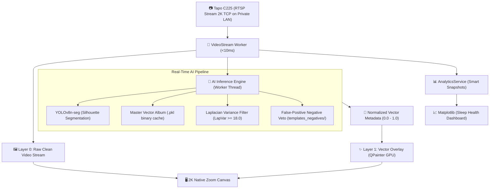

# 🧠 Architecture & Algorithmic Design — Tapo C225 AI Monitor

  <a href="#-english"><b>🇬🇧 English</b></a> • 
  <a href="#-español"><b>🇪🇸 Español</b></a>

---

# 🇬🇧 English

## 1. Decoupled 2-Layer Vector Pipeline

To achieve a rock-solid **30 FPS** video stream at 2K resolution without freezing the user interface, the system decouples video frame decoding from mathematical overlay rendering:

### Key Engineering Benefits:
- **Layer 0 (Raw Frame):** Decodes H.264/H.265 RTSP packets into memory buffers without blocking OpenCV or PySide6 threads.
- **Layer 1 (Vector Overlay):** Hardware-accelerated `QPainter` draws bounding boxes, corner badges, and polygonal segmentation masks using normalized coordinates (`0.0 - 1.0`).
- **Infinite Resolution Zoom:** Native ClearType fonts and sub-pixel antialiased geometry remain sharp regardless of zoom level.

---

## 2. Mathematical Vision Filters & Edge Inference

### A. Spatial Frequency & Laplacian Variance (`LapVar >= 15.0`)
Flat surfaces (bedsheets, blankets, crib wooden boards) have low-frequency spatial gradients, whereas human bodies present high-frequency textures:
$$\text{Var}(\Delta I) = \frac{1}{N} \sum_{x,y} (\nabla^2 I(x,y) - \mu)^2$$
Regions with $\text{Var}(\Delta I) < 15.0$ are discarded as flat bedding folds.

### B. Triple Veto Engine for Negative Templates
When evaluating candidate patches against bedding / background objects in `templates_negatives/`, a 3-layer veto is applied:
1. **Spatial Crib Proximity:** Gated suppression when candidate center falls inside a static background zone previously cropped by the user.
2. **Structural Normalized Cross-Correlation:** Direct template match against negative textures ($\text{Score} \ge 0.55$).
3. **HSV 2D Histogram Correlation:** Color distribution comparison invariant to lighting:
$$d(H_1, H_2) = \frac{\sum_{i} (H_1(i) - \bar{H}_1)(H_2(i) - \bar{H}_2)}{\sqrt{\sum_i (H_1(i) - \bar{H}_1)^2 \sum_i (H_2(i) - \bar{H}_2)^2}}$$

### C. Anti-Jitter & Temporal Inertial Tracking (EMA)
To eliminate abrupt bounding-box teleports to distant crib folds during single-frame YOLO dropouts:
- YOLO silhouette detections ($S=0.85$) serve as primary ground-truth anchor.
- Isolated template matches jumping $>150\text{ px}$ away from the active baby position with confidence $<72\%$ are suppressed.
- Smooth box transitions use Exponential Moving Average (EMA) with $\alpha = 0.35$ and a 1.5-second persistence window.

### D. Deadband Telemetry Compression
Sleep state transitions are recorded on-demand. Steady-state heartbeats run every 20s, reducing time-series disk I/O by 85% and condensing daily health records into ~1 KB JSON snapshots.

---

 

---

# 🇪🇸 Español

## 1. Pipeline Vectorial Desacoplado en 2 Capas

Para garantizar **30 FPS constantes** a resolución 2K sin congelar la interfaz gráfica, el motor separa la decodificación de video del dibujado de metadatos:
- **Capa 0 (Video Crudo):** Decodificación RTSP TCP en buffer de memoria ultra-rápido (<10ms).
- **Capa 1 (Overlay Vectorial):** Renderizado por hardware con `QPainter` sobre coordenadas normalizadas (`0.0 - 1.0`).
- **Zoom Nativo 2K:** Las fuentes tipográficas y las líneas vectoriales conservan nitidez infinita sin pixelado.

## 2. Filtros Matemáticos y Edge AI

- **Triple Veto de Falsos Positivos:** Combinación de proximidad espacial en la cuna, correlación estructural de textura y similitud cromática HSV para descartar sábanas y almohadas.
- **Tracker Anti-Jitter Inercial (EMA):** Anclaje neuronal con siluetas YOLO y suavizado temporal ($\alpha = 0.35$) con ventana de persistencia de 1.5s para evitar saltos erráticos a pliegues de tela.
- **Varianza Laplaciana (`LapVar >= 15.0`):** Elimina falsas alarmas provocadas por pliegues de sábanas o sombras planas sin textura.
- **Compresión Deadband:** Ahorro del 85% de disco mediante snapshots diarios de 1 KB (`data/analytics/snapshots/`).
